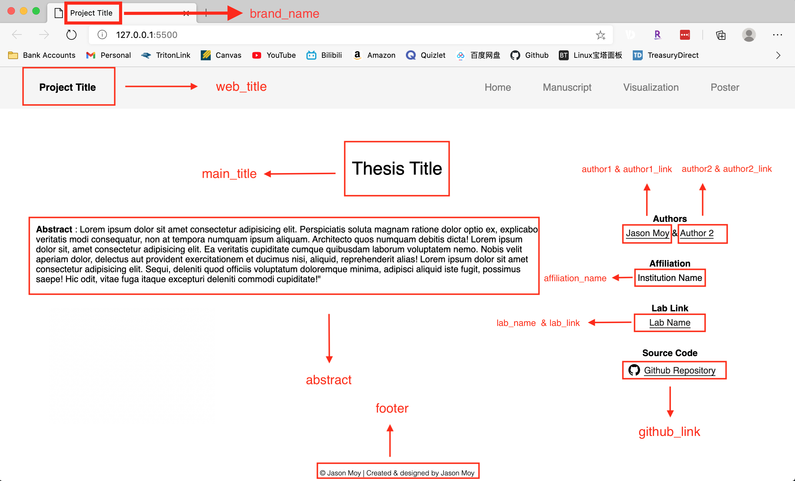

# Guide to this Repository 
<!-- badges: start -->
[](https://lifecycle.r-lib.org/articles/stages.html#stable)
<!-- badges: end -->
### Setting Up

1. Fork this template to your github by clicking the `Use this template` as shown on the image
   

2. Clone the repository to your local computer using terminal command (don't use it unless you actually want to learn `git` command) or using one of the GUI (highly recommend using [Source Tree](https://www.sourcetreeapp.com/) )

   * ```bash
     # Using the terminal command 
     git clone [https link] # the https link to your repo 
     ```

3. Initialize submodule (the submodule contains all the `CSS` file (i.e., the styling file of the website) using the terminal (highly recommend using GUI if you are not familiar with `git` command)

   * ```bash
     # On Mac or Linux 
     cd [path to your local git-repo] # e.g. my git repo is /Users/Jasonmoy/Desktop/jasonmoy_reasearch_site_example
     git submodule update --init --recursive #initialize the submodule
     
     #If you want to update the submodule 
     cd [submodule path]
     git pull 
     ```


### Modify the site

1. Store static files (e.g., png, pdf) in the corresponding sub-folder of the`~/static` folder is recommended

2. Changed the `content.js` file

   * `index.html`(i.e. the home page) reference graph

   

   * `manuscript` : you will need to change the source file path for the manuscript 
   * `visulization`: you will need to change the source file path for the graphs 
   * `poster`: you will need to change the source file path for the poster

3. If you need additional `CSS`, I recommend adding it in a new folder named `custom-style`, and never change anything in the submodule file. 


### Example Site 

1. An example site of this template is hosted [here](https://jasonmoy28.github.io/jasonmoy_reasearch_site_template/)
2. An site using this template to created is hosted [here](https://research.jasonmoy.us/Vocabulary_Learning_Project/)

